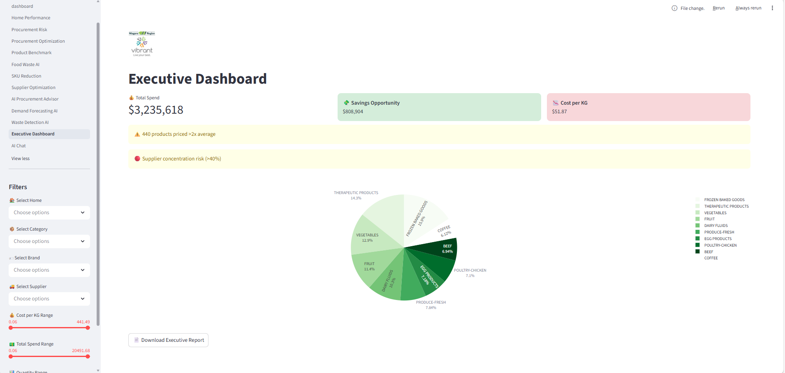

# 🚀 Niagara LTC Procurement Intelligence Dashboard

## 🌐 Live Application

👉 https://niagararegionproject-gj3ygnae3jgvk5b32faugk.streamlit.app

---

## 📊 Dashboard Preview

---

## 📌 Overview

This project is a **production-ready data analytics dashboard** built using **Python, Pandas, Plotly, and Streamlit** to analyze procurement data across **Niagara Region Long-Term Care (LTC) homes**.

It transforms raw procurement transaction data into **actionable, executive-level insights** that support:

- Cost optimization  
- Supplier performance evaluation  
- Procurement risk detection  
- Data-driven decision-making  

---

## 🎯 Business Problem

Long-Term Care (LTC) facilities incur significant operational costs through food procurement. However, procurement data is often:

- Fragmented  
- Underutilized  
- Not optimized for decision-making  

This project solves that problem by building a **centralized analytics platform** that enables management to:

- Identify inefficiencies  
- Detect pricing inconsistencies  
- Benchmark suppliers  
- Estimate cost-saving opportunities  

---

## 💡 Solution

An **interactive multi-page analytics dashboard** that provides:

- Real-time procurement insights  
- Supplier benchmarking models  
- Cost optimization simulations  
- AI-driven recommendations  

---

## 🔥 Key Features

### 📈 Procurement Analytics
- Total procurement spend across LTC homes  
- Cost comparison across facilities  
- Category-level spend analysis  

### 🧾 Supplier Benchmarking
- Compare supplier pricing against market benchmarks  
- Identify suppliers charging above average  

### ⚠️ Procurement Risk Detection
- Detect supplier concentration risks  
- Identify inconsistent or zero-cost entries  
- Highlight abnormal pricing patterns  

### 💰 Procurement Optimization
- Estimate potential savings from supplier negotiations  
- Identify high-impact cost reduction categories  

### 🤖 AI Procurement Advisor
- Automated insights generation  
- Decision-support recommendations for management  

### 📊 Multi-Page Dashboard Architecture
- Home Performance  
- Procurement Risk  
- Procurement Optimization  
- Product Benchmark  
- Food Waste AI  
- SKU Reduction  
- Supplier Optimization  
- AI Procurement Advisor  
- Demand Forecasting  
- Executive Dashboard  

---

## 🛠️ Tech Stack

| Category | Tools |
|--------|------|
| Programming | Python |
| Data Processing | Pandas |
| Visualization | Plotly |
| App Framework | Streamlit |
| Reporting | ReportLab |
| Architecture | Modular (Clean Architecture) |

---

## 🧱 Project Architecture

